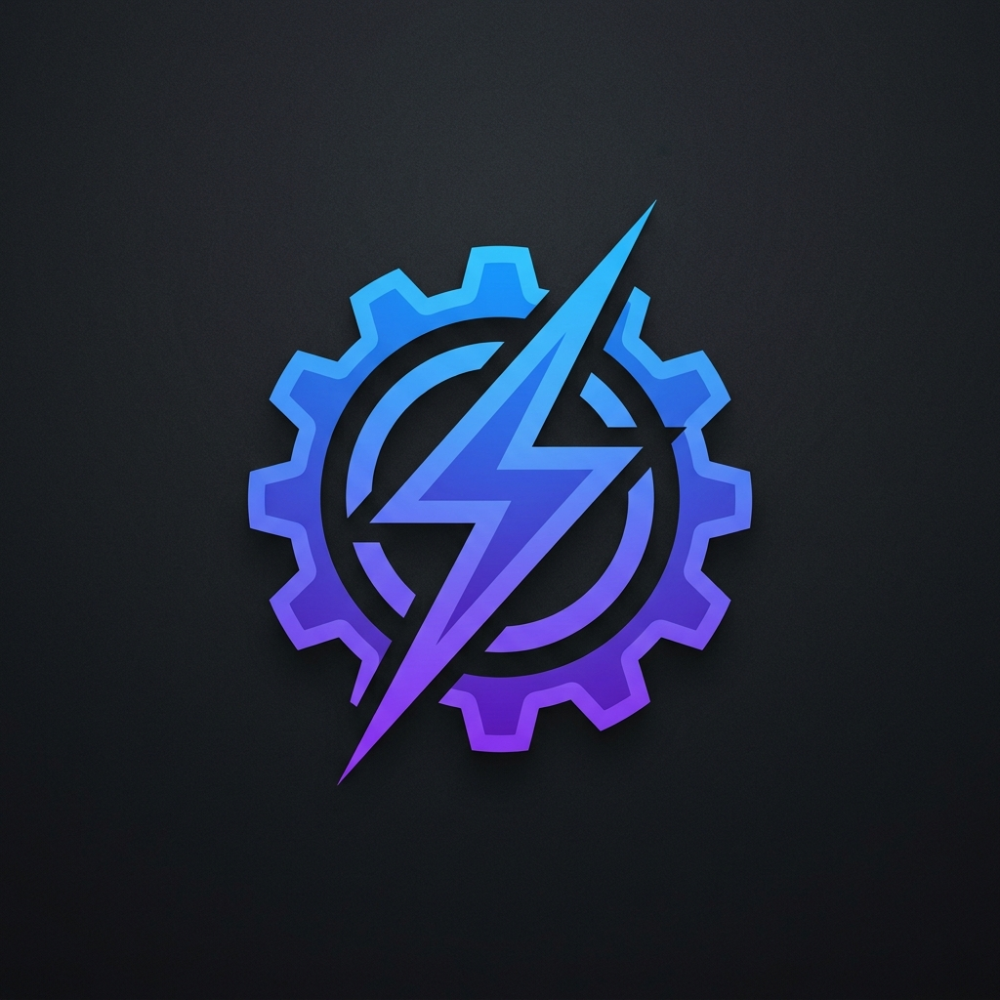

<p align="center">
  
</p>

# 🤖 CodeRouter

<p align="center">
  
  
  
</p>

> **Run Claude Code with ANY AI model — no Anthropic account needed. Now featuring ✨ Smart Vision Routing, 🧠 200+ Global Skills, and 🔌 MCP Integrations!**

[CodeRouter](https://github.com/iMayuuR/coderouter) is a configuration wrapper and local proxy for [Claude Code](https://docs.anthropic.com/en/docs/claude-code) (Anthropic's official AI coding agent) powered by [OpenRouter](https://openrouter.ai/). It gives you access to **hundreds of models** — including free ones — all through a single setup.

---

## ✨ Features

- **200+ Models:** GPT-4.1, Gemini 3.1 Pro, Llama 4, and more.
- **👁️ Smart Vision Proxy:** Detects image inputs and automatically routes them to a vision-capable free model (e.g., Qwen 2 VL) so your terminal never breaks.
- **🧠 200+ Agentic Skills:** Pre-loaded skills for brainstorming, TDD, debugging, code review, UI/UX design, browser automation, security auditing, and more — all available globally.
- **🔌 MCP Integrations:** Optional @21st-dev/magic — installer writes **user-scope** MCP in `~/.claude.json` (top-level `mcpServers`) so it appears in **all** projects when `MAGIC_API_KEY` is set.
- **🌍 Global Setup:** One command installs skills, proxy alias, and MCP across your entire system.
- **Zero Account Needed:** Use your OpenRouter API key.
- **Free Options:** Many powerful free models available.

---

## 🚀 One-Shot Setup

The easiest way to get started:

1. **Clone & Install**:
   ```bash
   git clone https://github.com/iMayuuR/coderouter.git
   cd coderouter && npm install
   ```

2. **Configure**:
   Copy `.env.example` to `.env` and add your [OpenRouter API Key](https://openrouter.ai/settings/keys).

3. **Global Setup**:
   From the repo folder run **`node install-global-skills.js`** (all platforms; reads `.env`). On Windows, optional **`.\setup-agent.ps1`** only if `ai-agent-config.json` exists — it merges prefs and runs the same installer. This wires **PowerShell profile / PATH**, **user env vars** (Windows), **200+ skills**, and optional **MCP** if `MAGIC_API_KEY` is set.

4. **⚠️ RESTART YOUR TERMINAL**:
   Close all sessions and reopen to apply changes.

5. **Type `claude` from ANY folder!**

> See the [QUICKSTART.md](QUICKSTART.md) for more details.

---

## 🧠 Bundled Skills (200+)

CodeRouter comes pre-loaded with **200+ agentic skills** that supercharge Claude Code:

| Category | Example Skills |
|---|---|
| **Development** | TDD, Systematic Debugging, Code Review, Git Worktrees |
| **Planning** | Brainstorming, Writing Plans, Executing Plans |
| **Security** | Shannon Pentester, Security Auditing |
| **UI/UX** | UI/UX Pro Max, Frontend Design, Web Artifacts |
| **Automation** | Browser Use, Parallel Agents, Subagent-Driven Development |
| **Memory** | Claude Mem (Persistent Memory across sessions) |

---

## 🔧 How It Works: The Smart Proxy

CodeRouter runs a tiny local Node.js proxy behind the scenes. It redirects Claude Code's requests and intercepts the JSON payload.
If it detects an **image** in your prompt, it momentarily routes the request to your configured `VISION_MODEL` (which supports images natively!). Otherwise, it sticks to your hyper-fast `CLAUDE_MODEL`.

```text
┌─────────────┐        ┌──────────────┐        ┌──────────────────┐
│             │        │              │──Text──▶│  Standard Model  │
│ Claude Code │──API──▶│ Local Proxy  │        └──────────────────┘
│ (Terminal)  │◀───────│ (localhost)  │        ┌──────────────────┐
│             │        │              │─Image─▶│  Video Model     │
└─────────────┘        └──────────────┘        └──────────────────┘
```

---

## 🤝 Contributing & Community

We welcome contributions! Please review our [Contributing Guidelines](CONTRIBUTING.md) and our [Code of Conduct](CODE_OF_CONDUCT.md).

---

## 📝 License

MIT — Free to use, modify, and share. Built with 💜 for the AI community.
